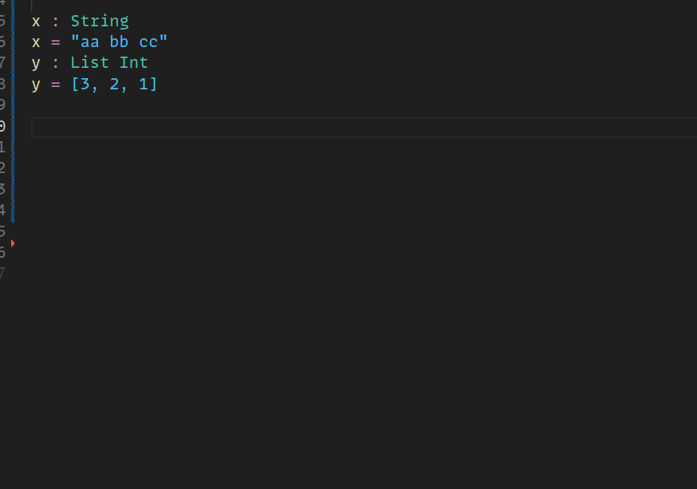
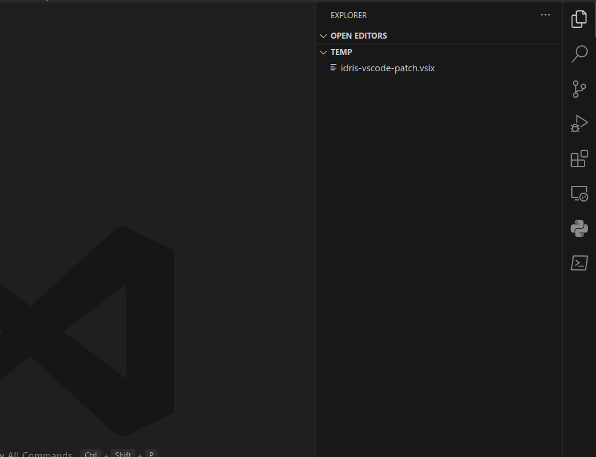

# idris2-vscode-patch

Patch for [meraymond's idris vscode extension](https://github.com/meraymond2/idris-ide-client) for module completions and native Windows support.

#### installation

- right click the .vsix file in the vscode file explorer
- click "Install Extension VSIX"
- restart vscode
- 👍

##### or alternatively:

- run `move-items.sh` (`move-items.ps1` on windows) 
- restart vscode
- 👍👍

the patch will be overridden if the extension is updated, so reapply it

